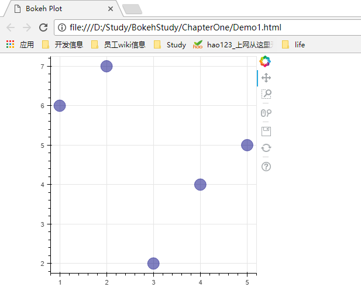

## 欢迎一起研究bokeh

一起学习bokeh

### 第一章bokeh是做什么的
bokeh就是一个可以自动生成js的工具
### 举个例子
```python
# -*- coding: utf-8 -*-
from bokeh.plotting import figure, output_file, show
from bokeh.plotting import figure

# 输出到一个静态的html页面
output_file("Demo1.html")

# 定义一个图形布局，指定宽高，之后的元素都画在这张图上
p = figure(plot_width=400, plot_height=400)

# 在坐标轴上画出圆圈，指定坐标大小，颜色和透明度（alpha）
p.circle([1, 2, 3, 4, 5], [6, 7, 2, 4, 5], size=20, color="navy", alpha=0.5)

# 在浏览器上打开生成的页面
show(p)
```
以上代码得到的图形如下


查看页面源码（或者打开生成的html文件，浏览器地址栏指出了文件路径），可以发现
```html
<!DOCTYPE html>
<html lang="en">
    <head>
        <meta charset="utf-8">
        <title>Bokeh Plot</title>
        
<link rel="stylesheet" href="https://cdn.pydata.org/bokeh/release/bokeh-0.12.10.min.css" type="text/css" />
        
<script type="text/javascript" src="https://cdn.pydata.org/bokeh/release/bokeh-0.12.10.min.js"></script>
<script type="text/javascript">
    Bokeh.set_log_level("info");
</script>
        <style>
          html {
            width: 100%;
            height: 100%;
          }
          body {
            width: 90%;
            height: 100%;
            margin: auto;
          }
        </style>
    </head>
    <body>
        
        <div class="bk-root">
            <div class="bk-plotdiv" id="a8f2c044-c093-4381-bf25-4b73e4728aea"></div>
        </div>
        
        <script type="text/javascript">
            (function() {
          var fn = function() {
            Bokeh.safely(function() {
              (function(root) {
                function embed_document(root) {
                  var docs_json = {"fef2da18-6a5d-4f27-8611-f4279b141215":{"roots":{"references":[{"attributes":{"source":{"id":"e9b7c248-e551-4cfb-b336-40106975318e","type":"ColumnDataSource"}},"id":"c9f1373d-39e2-4c8c-abfc-65008abe0688","type":"CDSView"},{"attributes":{"overlay":{"id":"3272077c-2f47-4132-ac08-14994a0f3af1","type":"BoxAnnotation"}},"id":"0fd270a0-47d5-461f-890d-d55efa7d98f7","type":"BoxZoomTool"},{"attributes":{"formatter":{"id":"25924213-e6ae-45d3-9853-faabd32debd1","type":"BasicTickFormatter"},"plot":{"id":"5b3f616f-5da2-4ee4-a8ca-c07834c5d9c2","subtype":"Figure","type":"Plot"},"ticker":{"id":"135bb74f-48af-438b-9a9c-572bc9404304","type":"BasicTicker"}},"id":"df2cc63d-c3a1-42a1-a8f4-e1464d52b2bd","type":"LinearAxis"},{"attributes":{"below":[{"id":"6639c602-f97c-4e31-8329-22b37c0cf733","type":"LinearAxis"}],"left":[{"id":"df2cc63d-c3a1-42a1-a8f4-e1464d52b2bd","type":"LinearAxis"}],"plot_height":400,"plot_width":400,"renderers":[{"id":"6639c602-f97c-4e31-8329-22b37c0cf733","type":"LinearAxis"},{"id":"5ad214cd-8cec-4bf5-96c4-06faee9e9930","type":"Grid"},{"id":"df2cc63d-c3a1-42a1-a8f4-e1464d52b2bd","type":"LinearAxis"},{"id":"82962a6a-16ef-4430-9b6d-2dd4816e2bff","type":"Grid"},{"id":"3272077c-2f47-4132-ac08-14994a0f3af1","type":"BoxAnnotation"},{"id":"b177f56e-b7ee-4436-804e-7b22ee9354f5","type":"GlyphRenderer"}],"title":{"id":"3c4d2d2f-c405-4c34-ad77-8a22f43030ec","type":"Title"},"toolbar":{"id":"d4fd4cb6-9395-4097-95f9-e89d23197abf","type":"Toolbar"},"x_range":{"id":"e42e3c5d-ca61-4ab2-a33e-48e9522755ac","type":"DataRange1d"},"x_scale":{"id":"a3ff54d6-a4ae-426e-95f4-1b5fa86dde13","type":"LinearScale"},"y_range":{"id":"9e3f38e6-9c9b-473b-8fc8-1e5c9b628c84","type":"DataRange1d"},"y_scale":{"id":"18c37411-815e-4c0b-a0f6-f31527982f60","type":"LinearScale"}},"id":"5b3f616f-5da2-4ee4-a8ca-c07834c5d9c2","subtype":"Figure","type":"Plot"},{"attributes":{},"id":"25924213-e6ae-45d3-9853-faabd32debd1","type":"BasicTickFormatter"},{"attributes":{},"id":"fa87bba0-5d7b-44c9-8111-7f480da26abb","type":"WheelZoomTool"},{"attributes":{},"id":"18e6b457-d182-4207-a347-fa2b2d0aa13e","type":"SaveTool"},{"attributes":{"callback":null},"id":"9e3f38e6-9c9b-473b-8fc8-1e5c9b628c84","type":"DataRange1d"},{"attributes":{"callback":null,"column_names":["y","x"],"data":{"x":[1,2,3,4,5],"y":[6,7,2,4,5]}},"id":"e9b7c248-e551-4cfb-b336-40106975318e","type":"ColumnDataSource"},{"attributes":{},"id":"8b7e0c37-5383-4f6c-a3a6-63d87a690529","type":"BasicTicker"},{"attributes":{},"id":"a3ff54d6-a4ae-426e-95f4-1b5fa86dde13","type":"LinearScale"},{"attributes":{},"id":"3572ad84-e29e-4eb7-8547-d254e846f472","type":"HelpTool"},{"attributes":{"fill_alpha":{"value":0.1},"fill_color":{"value":"#1f77b4"},"line_alpha":{"value":0.1},"line_color":{"value":"#1f77b4"},"size":{"units":"screen","value":20},"x":{"field":"x"},"y":{"field":"y"}},"id":"1cd66376-7760-46b6-8d28-276b488f03f6","type":"Circle"},{"attributes":{},"id":"a6b9b833-00b4-4559-9503-ef24907bc25c","type":"ResetTool"},{"attributes":{"bottom_units":"screen","fill_alpha":{"value":0.5},"fill_color":{"value":"lightgrey"},"left_units":"screen","level":"overlay","line_alpha":{"value":1.0},"line_color":{"value":"black"},"line_dash":[4,4],"line_width":{"value":2},"plot":null,"render_mode":"css","right_units":"screen","top_units":"screen"},"id":"3272077c-2f47-4132-ac08-14994a0f3af1","type":"BoxAnnotation"},{"attributes":{"formatter":{"id":"6ef54f62-cdb0-410b-93ce-3b5a583126db","type":"BasicTickFormatter"},"plot":{"id":"5b3f616f-5da2-4ee4-a8ca-c07834c5d9c2","subtype":"Figure","type":"Plot"},"ticker":{"id":"8b7e0c37-5383-4f6c-a3a6-63d87a690529","type":"BasicTicker"}},"id":"6639c602-f97c-4e31-8329-22b37c0cf733","type":"LinearAxis"},{"attributes":{},"id":"6ef54f62-cdb0-410b-93ce-3b5a583126db","type":"BasicTickFormatter"},{"attributes":{"active_drag":"auto","active_inspect":"auto","active_scroll":"auto","active_tap":"auto","tools":[{"id":"95790c42-0f0c-42d6-8f5a-5d32b63a1992","type":"PanTool"},{"id":"fa87bba0-5d7b-44c9-8111-7f480da26abb","type":"WheelZoomTool"},{"id":"0fd270a0-47d5-461f-890d-d55efa7d98f7","type":"BoxZoomTool"},{"id":"18e6b457-d182-4207-a347-fa2b2d0aa13e","type":"SaveTool"},{"id":"a6b9b833-00b4-4559-9503-ef24907bc25c","type":"ResetTool"},{"id":"3572ad84-e29e-4eb7-8547-d254e846f472","type":"HelpTool"}]},"id":"d4fd4cb6-9395-4097-95f9-e89d23197abf","type":"Toolbar"},{"attributes":{"callback":null},"id":"e42e3c5d-ca61-4ab2-a33e-48e9522755ac","type":"DataRange1d"},{"attributes":{},"id":"95790c42-0f0c-42d6-8f5a-5d32b63a1992","type":"PanTool"},{"attributes":{},"id":"18c37411-815e-4c0b-a0f6-f31527982f60","type":"LinearScale"},{"attributes":{},"id":"135bb74f-48af-438b-9a9c-572bc9404304","type":"BasicTicker"},{"attributes":{"plot":null,"text":""},"id":"3c4d2d2f-c405-4c34-ad77-8a22f43030ec","type":"Title"},{"attributes":{"dimension":1,"plot":{"id":"5b3f616f-5da2-4ee4-a8ca-c07834c5d9c2","subtype":"Figure","type":"Plot"},"ticker":{"id":"135bb74f-48af-438b-9a9c-572bc9404304","type":"BasicTicker"}},"id":"82962a6a-16ef-4430-9b6d-2dd4816e2bff","type":"Grid"},{"attributes":{"data_source":{"id":"e9b7c248-e551-4cfb-b336-40106975318e","type":"ColumnDataSource"},"glyph":{"id":"2465510d-d4c5-4e22-ac10-f27ef3e42ba0","type":"Circle"},"hover_glyph":null,"muted_glyph":null,"nonselection_glyph":{"id":"1cd66376-7760-46b6-8d28-276b488f03f6","type":"Circle"},"selection_glyph":null,"view":{"id":"c9f1373d-39e2-4c8c-abfc-65008abe0688","type":"CDSView"}},"id":"b177f56e-b7ee-4436-804e-7b22ee9354f5","type":"GlyphRenderer"},{"attributes":{"plot":{"id":"5b3f616f-5da2-4ee4-a8ca-c07834c5d9c2","subtype":"Figure","type":"Plot"},"ticker":{"id":"8b7e0c37-5383-4f6c-a3a6-63d87a690529","type":"BasicTicker"}},"id":"5ad214cd-8cec-4bf5-96c4-06faee9e9930","type":"Grid"},{"attributes":{"fill_alpha":{"value":0.5},"fill_color":{"value":"navy"},"line_alpha":{"value":0.5},"line_color":{"value":"navy"},"size":{"units":"screen","value":20},"x":{"field":"x"},"y":{"field":"y"}},"id":"2465510d-d4c5-4e22-ac10-f27ef3e42ba0","type":"Circle"}],"root_ids":["5b3f616f-5da2-4ee4-a8ca-c07834c5d9c2"]},"title":"Bokeh Application","version":"0.12.10"}};
                  var render_items = [{"docid":"fef2da18-6a5d-4f27-8611-f4279b141215","elementid":"a8f2c044-c093-4381-bf25-4b73e4728aea","modelid":"5b3f616f-5da2-4ee4-a8ca-c07834c5d9c2"}];
              
                  root.Bokeh.embed.embed_items(docs_json, render_items);
                }
              
                if (root.Bokeh !== undefined) {
                  embed_document(root);
                } else {
                  var attempts = 0;
                  var timer = setInterval(function(root) {
                    if (root.Bokeh !== undefined) {
                      embed_document(root);
                      clearInterval(timer);
                    }
                    attempts++;
                    if (attempts > 100) {
                      console.log("Bokeh: ERROR: Unable to embed document because BokehJS library is missing")
                      clearInterval(timer);
                    }
                  }, 10, root)
                }
              })(window);
            });
          };
          if (document.readyState != "loading") fn();
          else document.addEventListener("DOMContentLoaded", fn);
        })();
        
        </script>
    </body>
</html>
```
从这段HTML中可以发现两个json对象：render_items和docs_json，图形的数据就在doc_json中。同时，有个class为"bk-root"的div元素来展示图形，另外自动引入了cdn网站的css和js文件。
我们可以通过file_html函数获取到，print函数打印出来的内容与上面文本一样
```python
# -*- coding: utf-8 -*-
from bokeh.plotting import figure
from bokeh.embed import file_html
from bokeh.resources import CDN

# 定义一个图形布局，指定宽高，之后的元素都画在这张图上
p = figure(plot_width=400, plot_height=400)

# 在坐标轴上画出圆圈，指定坐标大小，颜色和透明度（alpha）
p.circle([1, 2, 3, 4, 5], [6, 7, 2, 4, 5], size=20, color="navy", alpha=0.5)

# 获取生成的html，指定资源来cdn网站
html = file_html(p, CDN)
print(html)
```
或者，我们可以通过components函数方式分别获取到js和html代码
```python
# -*- coding: utf-8 -*-
from bokeh.plotting import figure
from bokeh.embed import components

# 定义一个图形布局，指定宽高，之后的元素都画在这张图上
p = figure(plot_width=400, plot_height=400)

# 在坐标轴上画出圆圈，指定坐标大小，颜色和透明度（alpha）
p.circle([1, 2, 3, 4, 5], [6, 7, 2, 4, 5], size=20, color="navy", alpha=0.5)

# 获取生成的html，指定资源来cdn网站
script, div = components(p)
print(script)
print("---------------------------------------------")
print(div)
```
以上输出内容如下:
```html
<script type="text/javascript">
    (function() {
  var fn = function() {
    Bokeh.safely(function() {
      (function(root) {
        function embed_document(root) {
          var docs_json = {"2f812de8-0d2c-49f5-be66-97b9f1c487a0":{"roots":{"references":[{"attributes":{},"id":"8f705dd6-5588-4376-b1d7-6183c7478e39","type":"LinearScale"},{"attributes":{"data_source":{"id":"44edcec5-ab99-40c4-a0bd-602dbc6df83a","type":"ColumnDataSource"},"glyph":{"id":"d9cefcc3-2c7f-4692-b7d3-28c768415d1d","type":"Circle"},"hover_glyph":null,"muted_glyph":null,"nonselection_glyph":{"id":"60f71218-c35d-4455-886c-d14d4ae5281f","type":"Circle"},"selection_glyph":null,"view":{"id":"688c9cbe-e27b-4c19-bb8a-01a93a32b0c0","type":"CDSView"}},"id":"310ba9e4-c8de-4590-9dff-59849ed6e70b","type":"GlyphRenderer"},{"attributes":{"plot":{"id":"14dbd1d9-9ce6-4015-be6a-5c09e4f37208","subtype":"Figure","type":"Plot"},"ticker":{"id":"97406f89-7ff6-40bd-9b18-1c9170cf8361","type":"BasicTicker"}},"id":"1e4bd542-940c-4e7e-8d77-95374c527896","type":"Grid"},{"attributes":{"fill_alpha":{"value":0.5},"fill_color":{"value":"navy"},"line_alpha":{"value":0.5},"line_color":{"value":"navy"},"size":{"units":"screen","value":20},"x":{"field":"x"},"y":{"field":"y"}},"id":"d9cefcc3-2c7f-4692-b7d3-28c768415d1d","type":"Circle"},{"attributes":{"below":[{"id":"63c4296e-e360-4fc3-9e4f-d24a07dc2834","type":"LinearAxis"}],"left":[{"id":"2c808025-51e5-4303-b4c2-f67c7fffdfde","type":"LinearAxis"}],"plot_height":400,"plot_width":400,"renderers":[{"id":"63c4296e-e360-4fc3-9e4f-d24a07dc2834","type":"LinearAxis"},{"id":"1e4bd542-940c-4e7e-8d77-95374c527896","type":"Grid"},{"id":"2c808025-51e5-4303-b4c2-f67c7fffdfde","type":"LinearAxis"},{"id":"09f2945a-4134-43d3-9fe1-566609d62f48","type":"Grid"},{"id":"ce640f8a-963c-4c94-886f-a2eb7eb23cc3","type":"BoxAnnotation"},{"id":"310ba9e4-c8de-4590-9dff-59849ed6e70b","type":"GlyphRenderer"}],"title":{"id":"f1ba7d96-c1b2-4dbe-b66c-69ff80957548","type":"Title"},"toolbar":{"id":"1ad7400c-322d-47ef-8721-874c50846f25","type":"Toolbar"},"x_range":{"id":"3787f820-882d-4051-bbfd-2eecf043316d","type":"DataRange1d"},"x_scale":{"id":"8f705dd6-5588-4376-b1d7-6183c7478e39","type":"LinearScale"},"y_range":{"id":"18f55766-8bb9-4fc2-b4f5-9f7fd293203e","type":"DataRange1d"},"y_scale":{"id":"254d2985-7573-4730-9cdf-b498515aa7bf","type":"LinearScale"}},"id":"14dbd1d9-9ce6-4015-be6a-5c09e4f37208","subtype":"Figure","type":"Plot"},{"attributes":{},"id":"f399cf76-3b8b-431d-9685-badb3892de48","type":"BasicTickFormatter"},{"attributes":{"formatter":{"id":"f399cf76-3b8b-431d-9685-badb3892de48","type":"BasicTickFormatter"},"plot":{"id":"14dbd1d9-9ce6-4015-be6a-5c09e4f37208","subtype":"Figure","type":"Plot"},"ticker":{"id":"970209c7-882c-4f52-8c9d-64756f30afac","type":"BasicTicker"}},"id":"2c808025-51e5-4303-b4c2-f67c7fffdfde","type":"LinearAxis"},{"attributes":{"callback":null},"id":"3787f820-882d-4051-bbfd-2eecf043316d","type":"DataRange1d"},{"attributes":{"callback":null,"column_names":["y","x"],"data":{"x":[1,2,3,4,5],"y":[6,7,2,4,5]}},"id":"44edcec5-ab99-40c4-a0bd-602dbc6df83a","type":"ColumnDataSource"},{"attributes":{"active_drag":"auto","active_inspect":"auto","active_scroll":"auto","active_tap":"auto","tools":[{"id":"f53ad2c7-aed9-43f9-b732-5b2aa27e52a7","type":"PanTool"},{"id":"80ff822f-ac4e-49c4-9665-2523ca6e95f7","type":"WheelZoomTool"},{"id":"180ebdf4-254b-4664-b9ad-183dfbeec172","type":"BoxZoomTool"},{"id":"148fb013-6116-42b9-8aa3-b5191ddddeb8","type":"SaveTool"},{"id":"a8f2cae6-5325-43f8-afeb-e889c8d29826","type":"ResetTool"},{"id":"eeb4abc3-1768-4764-917b-e86e718748c7","type":"HelpTool"}]},"id":"1ad7400c-322d-47ef-8721-874c50846f25","type":"Toolbar"},{"attributes":{},"id":"a8f2cae6-5325-43f8-afeb-e889c8d29826","type":"ResetTool"},{"attributes":{"plot":null,"text":""},"id":"f1ba7d96-c1b2-4dbe-b66c-69ff80957548","type":"Title"},{"attributes":{},"id":"148fb013-6116-42b9-8aa3-b5191ddddeb8","type":"SaveTool"},{"attributes":{},"id":"80ff822f-ac4e-49c4-9665-2523ca6e95f7","type":"WheelZoomTool"},{"attributes":{"overlay":{"id":"ce640f8a-963c-4c94-886f-a2eb7eb23cc3","type":"BoxAnnotation"}},"id":"180ebdf4-254b-4664-b9ad-183dfbeec172","type":"BoxZoomTool"},{"attributes":{"callback":null},"id":"18f55766-8bb9-4fc2-b4f5-9f7fd293203e","type":"DataRange1d"},{"attributes":{"fill_alpha":{"value":0.1},"fill_color":{"value":"#1f77b4"},"line_alpha":{"value":0.1},"line_color":{"value":"#1f77b4"},"size":{"units":"screen","value":20},"x":{"field":"x"},"y":{"field":"y"}},"id":"60f71218-c35d-4455-886c-d14d4ae5281f","type":"Circle"},{"attributes":{},"id":"97406f89-7ff6-40bd-9b18-1c9170cf8361","type":"BasicTicker"},{"attributes":{"dimension":1,"plot":{"id":"14dbd1d9-9ce6-4015-be6a-5c09e4f37208","subtype":"Figure","type":"Plot"},"ticker":{"id":"970209c7-882c-4f52-8c9d-64756f30afac","type":"BasicTicker"}},"id":"09f2945a-4134-43d3-9fe1-566609d62f48","type":"Grid"},{"attributes":{"bottom_units":"screen","fill_alpha":{"value":0.5},"fill_color":{"value":"lightgrey"},"left_units":"screen","level":"overlay","line_alpha":{"value":1.0},"line_color":{"value":"black"},"line_dash":[4,4],"line_width":{"value":2},"plot":null,"render_mode":"css","right_units":"screen","top_units":"screen"},"id":"ce640f8a-963c-4c94-886f-a2eb7eb23cc3","type":"BoxAnnotation"},{"attributes":{},"id":"f53ad2c7-aed9-43f9-b732-5b2aa27e52a7","type":"PanTool"},{"attributes":{},"id":"970209c7-882c-4f52-8c9d-64756f30afac","type":"BasicTicker"},{"attributes":{"source":{"id":"44edcec5-ab99-40c4-a0bd-602dbc6df83a","type":"ColumnDataSource"}},"id":"688c9cbe-e27b-4c19-bb8a-01a93a32b0c0","type":"CDSView"},{"attributes":{},"id":"eeb4abc3-1768-4764-917b-e86e718748c7","type":"HelpTool"},{"attributes":{},"id":"254d2985-7573-4730-9cdf-b498515aa7bf","type":"LinearScale"},{"attributes":{"formatter":{"id":"15118476-67bb-4b2b-9e0d-6e33dd506379","type":"BasicTickFormatter"},"plot":{"id":"14dbd1d9-9ce6-4015-be6a-5c09e4f37208","subtype":"Figure","type":"Plot"},"ticker":{"id":"97406f89-7ff6-40bd-9b18-1c9170cf8361","type":"BasicTicker"}},"id":"63c4296e-e360-4fc3-9e4f-d24a07dc2834","type":"LinearAxis"},{"attributes":{},"id":"15118476-67bb-4b2b-9e0d-6e33dd506379","type":"BasicTickFormatter"}],"root_ids":["14dbd1d9-9ce6-4015-be6a-5c09e4f37208"]},"title":"Bokeh Application","version":"0.12.10"}};
          var render_items = [{"docid":"2f812de8-0d2c-49f5-be66-97b9f1c487a0","elementid":"ad783c20-4dea-4eef-9aad-4ee017d25800","modelid":"14dbd1d9-9ce6-4015-be6a-5c09e4f37208"}];
      
          root.Bokeh.embed.embed_items(docs_json, render_items);
        }
      
        if (root.Bokeh !== undefined) {
          embed_document(root);
        } else {
          var attempts = 0;
          var timer = setInterval(function(root) {
            if (root.Bokeh !== undefined) {
              embed_document(root);
              clearInterval(timer);
            }
            attempts++;
            if (attempts > 100) {
              console.log("Bokeh: ERROR: Unable to embed document because BokehJS library is missing")
              clearInterval(timer);
            }
          }, 10, root)
        }
      })(window);
    });
  };
  if (document.readyState != "loading") fn();
  else document.addEventListener("DOMContentLoaded", fn);
})();

</script>
---------------------------------------------

<div class="bk-root">
    <div class="bk-plotdiv" id="ad783c20-4dea-4eef-9aad-4ee017d25800"></div>
</div>
```
那既然可以分别获取，那我们就可以指定模板，然后将这两段代码嵌入进去，如下：
```python
# -*- coding: utf-8 -*-
from bokeh.plotting import figure
from bokeh.embed import components

# 定义一个图形布局，指定宽高，之后的元素都画在这张图上
p = figure(plot_width=400, plot_height=400)

# 在坐标轴上画出圆圈，指定坐标大小，颜色和透明度（alpha）
p.circle([1, 2, 3, 4, 5], [6, 7, 2, 4, 5], size=20, color="navy", alpha=0.5)

# 获取生成的html，指定资源来cdn网站
script, div = components(p)

html = """<!DOCTYPE html>
<html lang="en">
    <head>
        <meta charset="utf-8">
        <title>Bokeh Scatter Plots</title>
        <link rel="stylesheet" href="https://cdn.pydata.org/bokeh/release/bokeh-0.12.10.min.css" type="text/css" />
        <script type="text/javascript" src="https://cdn.pydata.org/bokeh/release/bokeh-0.12.10.min.js"></script>

        <!-- COPY/PASTE SCRIPT HERE -->
        {}
    </head>
    <body>
    
        <!-- INSERT DIVS HERE -->
        {}
    </body>
</html>""".format(div, script)

with open('demo2.html', 'w') as f:
    f.write(html)

```
通过以上可以大致了解到bokeh操控的就是js


```markdown
Syntax highlighted code block

# Header 1
## Header 2
### Header 3

- Bulleted
- List

1. Numbered
2. List

**Bold** and _Italic_ and `Code` text

[Link](url) and 
```

For more details see [GitHub Flavored Markdown](https://guides.github.com/features/mastering-markdown/).

### Jekyll Themes

Your Pages site will use the layout and styles from the Jekyll theme you have selected in your [repository settings](https://github.com/e271828182/BokehStudy/settings). The name of this theme is saved in the Jekyll `_config.yml` configuration file.

### Support or Contact

Having trouble with Pages? Check out our [documentation](https://help.github.com/categories/github-pages-basics/) or [contact support](https://github.com/contact) and we’ll help you sort it out.
